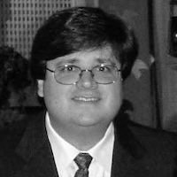

## InterSociety Mission Statement

*The Inter-Society for the Enhancement of Cinema Presentation, Inc. promotes interactive dialogue and information exchange between cinema-related entities with the goal of resolving issues affecting the overall cinema presentation.*

### Leadership

The Inter-Society's Board of Directors are volunteers from across the entertainment industry

#### Board of Directors (2026)

##### President

**Steve LLamb**
*VP, Technology Standards and Solutions*
*Deluxe*
*(Term 2026-2028)*

##### Vice President

**Reiner Doetzkies**
*Director, Cinema Business and Technology Development*
*Sharp*
*(Term 2024-2026)*

##### Secretary/Treasurer

**Mark Waterson**
*Executive Vice President, Qube Wire*
*Qube Cinema, Inc.*
*(Term 2024-2026)*

##### Executive Director (Interim)

**Pierre-Anthony Lemieux**
*Chairman (Interim) | ISDCF*

#### Board Members

**Mark Collins**
*Independent*
*(Term 2025-2027)*

**David Deelo**
*Executive Director*
*Sony Pictures Technology Development*
*(Term 2026-2028)*

**Kirk Griffin**
*Director of Presentation Technologies*
*Harkins Theaters*
*(Term 2025-2027)*

**Andrew Poulain**
*Director, Cinema & Group Entertainment Product Management*
*Dolby Laboratories*
*(Term 2026-2028)*

**Mike Radford**
*VP Technology Solutions*
*Walt Disney Studios*
*(Term 2025-2027)*

**Sean Romano**
*SVP of Operations*
*Eikon Group*
*(Term 2024-2026)*

#### Executive Director Emeritus In Memoriam

**Jerry Pierce**
*Chairman | ISDCF*

[In Memoriam – Jerry Pierce](/intersociety/jerry-pierce/)

#### CHAIRMAN EMERITI

Paul Holliman, Disney (2019-2020)

Susie Beiersdorf, Christie Digital (2016-2019)

Curt Behlmer, Dolby (2013-2016)

Mark Christiansen, Paramount Pictures (2011 – 2013)

John Pytlak, Eastman Kodak (2004 – 2007)

J. Wayne Anderson, Anderson Consulting (2002 – 2004)

## Bylaws of InterSociety

These Bylaws were adopted in December of 2023. [I-S Bylaws Adopted 2023](https://www.isdcf.com/wp-content/uploads/2023/12/I-S-Bylaws-2023-FINAL.pdf)
